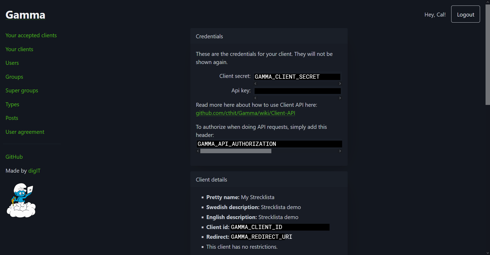

# CONTRIBUTING

Thank you for your interest in contributing to the strecklista backend!
Contributions are very appreciated, if you are looking for something to help
with check out the
[issues](https://github.com/olillin/strecklista-backend/issues) page.

## Developing

This page will run you through how to develop the project locally.

## Prerequisites

To be able to setup and run the server you will need the following:

- A [Gamma](https://auth.chalmers.it) account
- [NodeJS](https://nodejs.org/en/download)
- [pnpm](https://pnpm.io/installation)
- [Git](https://git-scm.com/downloads)
- [Docker Compose](https://docs.docker.com/compose/install/)
- A text editor
- A terminal

## Getting started

1. [Initial setup](#initial-setup)
2. [Starting the server](#starting-the-server)
3. [Setup the database](#setup-the-database)

### Initial setup

1. Start by cloning the repository:

    ```shell
    git clone https://github.com/olillin/strecklista-backend
    ```

2. The backend requires a Gamma client to authenticate users and provide access
    to profile and group information. Follow the instructions in the
    [Gamma docs](https://gamma-docs.olillin.com/website/#creating-a-user-client).
    Make sure that _Generate api key_ is selected and _Redirect url_ is set to
    the callback URL for your frontend. If you are using the
    [frontend by Göken](https://github.com/erikpersson0884/strecklista) the
    redirect url should be `http://localhost:3000/callback`.

    Then copy the `.env.example` file to `.env` and fill in the details from
    your newly created Gamma client according to the labels in the image below:

    

3. Generate the Prisma client:

    ```shell
    pnpm prisma:generate
    ```

### Starting the server

Now you are ready to start the server. Run the following command in the
terminal:

```shell
pnpm dev
```

This will (re)build the Docker image and start both the server and the
database.

### Setup the database

To create the tables in the database you must run this command:

```console
pnpm prisma:push
```

The development database is not saved between restarts, you may want to add
development data with the seed:

```console
pnpm prisma:seed
```

## Configuration

See [DEPLOYMENT](./docs/DEPLOYMENT.md) for more info about configuring the
server.
